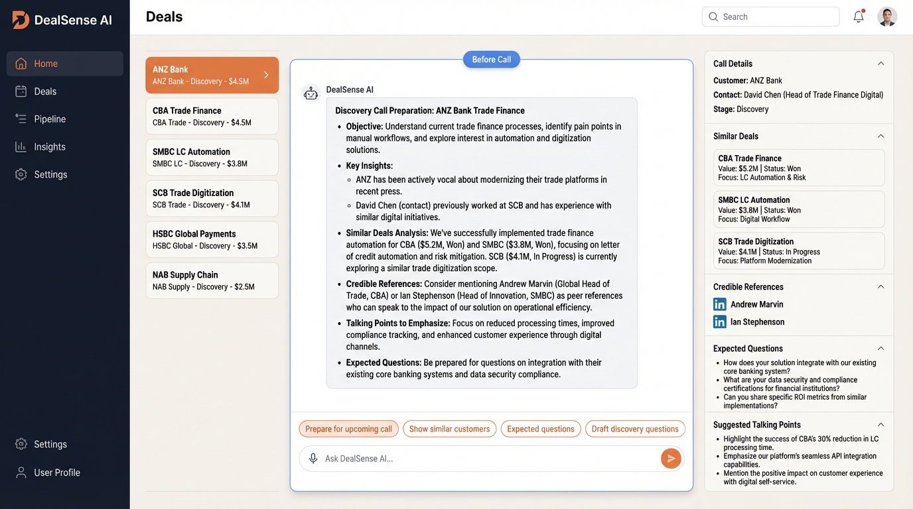
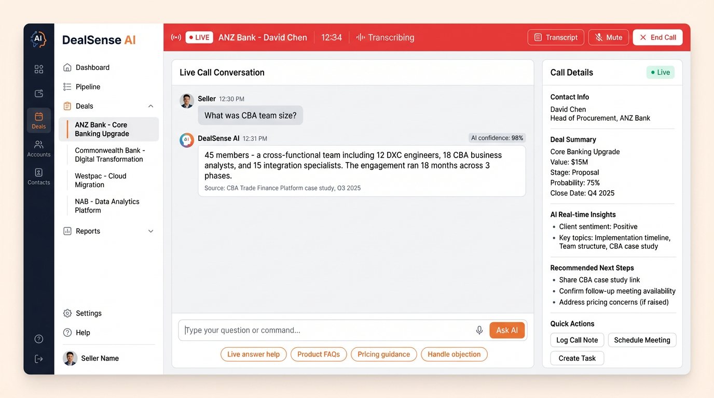
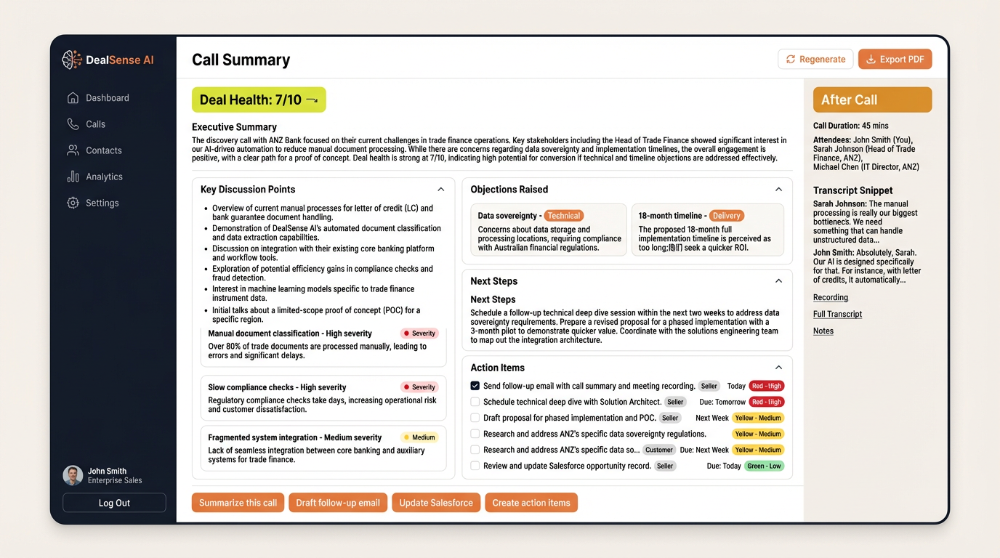

# DealSense AI - Sales Assist Agent

An AI-powered sales assistant that leverages meeting notes (MoMs) to provide intelligent insights and automate post-call documentation.

## Business Problem

Enterprise B2B sellers spend 1-2 hours per day on post-call admin (CRM updates, MoMs, follow-ups), causing:

- **Missed follow-ups and lost deals** -- critical action items slip through the cracks
- **Inconsistent deal documentation** -- MoM quality varies by rep, making handoffs unreliable
- **Leadership blind spots on deal health** -- managers lack timely, structured signals to intervene early

## Solution

DealSense AI reduces seller admin time by 60-70% and increases follow-up completion by 40% through:

- **Real-time AI-powered call assistance** -- contextual retrieval from past MoMs during live calls
- **Automated MoM generation with PII protection** -- structured, compliant meeting notes in seconds
- **Proactive deal risk detection** -- surface stalled deals and missed commitments before they escalate

## Target User

Enterprise account executives at DXC's Financial Services and Banking clients (ANZ, Westpac, CBA) who manage complex, multi-stakeholder deal cycles and need reliable post-call automation.

## Impact Metrics

| Metric | Measurement | Target |
|--------|-------------|--------|
| Seller admin time saved | Hours saved per seller per week | 5-7 hrs/week (60-70% reduction) |
| MoM accuracy | % of key topics and action items captured vs. manual baseline | > 90% |
| Follow-up completion rate | % of AI-identified action items completed on time | 40% improvement over baseline |
| Deal velocity | Average days from opportunity creation to close | 10-15% reduction |
| Adoption rate | % of target sellers actively using the tool weekly | > 80% within first quarter |

## Product Screenshots

### Before Call -- Pre-Call Preparation
The seller selects a deal and instantly gets AI-curated context: similar deals won, credible references, expected questions, and talking points.



### During Call -- Live AI Assistant
Real-time RAG-powered answers via push-to-talk (Shift+Space). The seller asks "What was CBA team size?" and gets a sourced answer in under 5 seconds.



### After Call -- Automated Summary & Action Items
AI generates a structured MoM with deal health score, key discussion points, pain points, objections, and prioritized action items -- ready for SharePoint write-back.



> For a full walkthrough, see the [Demo Script](docs/DEMO_SCRIPT.md).

## Architecture Overview

| Flow Step          | Azure Service                      | Purpose                     |
| ------------------ | ---------------------------------- | --------------------------- |
| SharePoint input   | Microsoft Graph API                | Native, secure access       |
| Ingestion job      | Azure Function (Timer Trigger)     | Serverless ingestion        |
| Raw doc storage    | Azure Blob Storage                 | Store original text         |
| Sanitization (PII) | Azure Container App (SLM)          | Runs inside VNet            |
| Chunking           | Same Container App                 | Text processing             |
| Embeddings         | Azure OpenAI (Embeddings)          | Enterprise-safe             |
| Vector DB          | Azure AI Search (vector)           | Managed vector search       |
| Retrieval (RAG)    | Azure Function / API App           | Stateless logic             |
| Reasoning LLM      | Azure OpenAI (GPT-4.x)             | Enterprise controls         |
| UI                 | Static Web App / Teams tab         | Fast MVP                    |
| Write-back         | Graph API -> SharePoint            | Source of truth             |

## Project Structure

```
dealsense-ai/
├── backend/
│   ├── agents/                  # Agentic AI orchestration layer
│   │   ├── base_agent.py              # Base agent framework (5-phase loop)
│   │   ├── pre_call_prep_agent.py     # Pre-Call Prep Agent
│   │   ├── risk_detection_agent.py    # Risk Detection Agent
│   │   └── follow_up_agent.py         # Follow-Up Orchestration Agent
│   ├── orchestration/           # RAG orchestration
│   │   └── hybrid_answer.py           # Hybrid RAG + Web + LLM
│   ├── retrieval/               # Vector search
│   ├── llm/                     # LLM integration
│   ├── ingestion/               # Data ingestion pipeline
│   ├── summarization/           # Call summary generation
│   ├── privacy/                 # PII protection, auth, audit
│   ├── storage/                 # Data persistence (JSON, Redis)
│   ├── websocket/               # Live call WebSocket handling
│   ├── models/                  # Pydantic data models
│   └── api.py                   # FastAPI endpoints
├── ui/                          # User interface
│   └── seller_panel/            # Seller dashboard (React)
├── infra/                       # Infrastructure as Code
├── docs/                        # Documentation
└── tests/                       # Test suites
```

## Agentic Behaviors

DealSense AI implements an **Agentic AI** architecture where autonomous agents follow a structured reasoning loop to make decisions, use tools, and validate their own output. Each agent operates with the same 5-phase loop:

```
 PERCEPTION ──> PLANNING ──> TOOL EXECUTION ──> REFLECTION ──> ACTION
     │              │              │                 │             │
  Parse input   Decide which   Call RAG search,   Validate      Return result
  & extract     tools to use   web search, LLM,   completeness  or trigger
  context       & in what      CRM lookup, etc.   & confidence  follow-up
                order                                            actions
```

### Agent 1: Pre-Call Prep Agent

**Trigger**: Seller opens a deal or requests pre-call preparation.

| Phase | What it does |
|-------|-------------|
| **Perception** | Extracts deal_id, account name, industry, description, contact role |
| **Planning** | Schedules 4 tool calls: RAG similar-deal search, credible reference lookup, talking-point generation, expected-question anticipation |
| **Tool Execution** | Runs semantic search against the vector DB for similar deals; retrieves reference contacts; calls LLM to generate talking points and anticipated customer questions |
| **Reflection** | Checks: Do we have relevant similar deals? References? Talking points? Flags any gaps (e.g., "No credible references found") and adjusts confidence score |
| **Action** | Returns a consolidated pre-call brief with similar deals, references, talking points, expected questions, and any preparation gaps |

**API**: `POST /api/agents/pre-call-prep`

### Agent 2: Risk Detection Agent

**Trigger**: After a call ends or on a real-time transcript snippet during a call.

| Phase | What it does |
|-------|-------------|
| **Perception** | Parses the transcript and deal metadata |
| **Planning** | Schedules keyword scan (fast, rule-based) and, for substantial transcripts, an LLM deep-analysis |
| **Tool Execution** | Runs regex keyword scan for competitor mentions, pricing pushback, stalling signals, timeline risks; then sends transcript to LLM for nuanced risk detection (stakeholder misalignment, champion absence, scope creep) |
| **Reflection** | Merges keyword and LLM findings, deduplicates by category, keeps the highest-severity signal per category, computes overall risk level (none/low/medium/high/critical) |
| **Action** | Returns risk alerts with severity, evidence, and actionable recommendations; triggers escalation alert if risk is high/critical |

**API**: `POST /api/agents/risk-detection`

### Agent 3: Follow-Up Orchestration Agent

**Trigger**: Post-call, when the seller ends a call.

| Phase | What it does |
|-------|-------------|
| **Perception** | Parses full transcript plus call metadata (account, seller, deal stage) |
| **Planning** | Schedules 4 tools: MoM generation, action-item extraction, MEDDPICC qualification gap check, deal health scoring |
| **Tool Execution** | Generates structured Minutes of Meeting; extracts action items with owners and deadlines; checks which qualification fields (budget, timeline, decision criteria, champion, etc.) were discussed; scores deal health 1-10 |
| **Reflection** | Cross-validates: Are action items consistent with MoM? Are there critical qualification gaps? Is the health score justified? Flags issues and adjusts confidence |
| **Action** | Returns a complete follow-up package: MoM, action items, qualification assessment, deal health score; triggers follow-up actions (send email, CRM update, escalation if health is low) |

**API**: `POST /api/agents/follow-up`

### Agent Trace (Observability)

Every agent response includes an `agent_trace` array showing the execution of each phase with timing, enabling full observability:

```json
{
  "success": true,
  "confidence": 0.85,
  "output": { ... },
  "agent_trace": [
    {"phase": "perception", "description": "Parsed deal context for ANZ Bank", "duration_ms": 2.1},
    {"phase": "planning", "description": "Planned 4 tool calls", "duration_ms": 0.3},
    {"phase": "tool_execution", "description": "Executed semantic_search", "duration_ms": 450.2},
    {"phase": "tool_execution", "description": "Executed credible_references", "duration_ms": 120.5},
    {"phase": "reflection", "description": "Confidence=85%, gaps=1", "duration_ms": 1.0},
    {"phase": "action", "description": "Produced final output", "duration_ms": 0.5}
  ],
  "total_duration_ms": 1205.3,
  "needs_follow_up": true,
  "follow_up_actions": [...]
}
```

## Team Responsibilities

| Person | Focus Area | Components |
|--------|------------|------------|
| Person 1 | Data / Backend | SharePoint connector, Ingestion job, Chunking + embeddings, Vector DB setup |
| Person 2 | AI / RAG | Prompt design, Retrieval logic, LLM integration, Output formatting |
| Person 3 | UI / Integration | Simple UI or Teams panel, Seller approval flow, Write-back to SharePoint |

## Branching Strategy

| Branch      | Who         | Purpose             |
| ----------- | ----------- | ------------------- |
| `main`      | CI/CD only  | Stable, deployable  |
| `dev`       | All devs    | Integration testing |
| `feature/*` | Individuals | New features        |
| `fix/*`     | Individuals | Bug fixes           |

### Branch Naming Examples

- `feature/sharepoint-ingestion`
- `feature/vector-retrieval`
- `feature/mom-generation`
- `fix/pii-redaction-bug`

## Getting Started

```bash
# Clone the repository
git clone https://github.com/ravikiran10jan/dealsense-ai.git
cd dealsense-ai

# Create a virtual environment
python -m venv .venv
source .venv/bin/activate  # On Windows: .venv\Scripts\activate

# Install dependencies
pip install -r requirements.txt

# Copy environment template
cp .env.example .env
# Edit .env with your configuration
```

## Prerequisites

- Python 3.10+
- Azure subscription
- Microsoft 365 tenant with SharePoint access
- Azure OpenAI access

## License

Proprietary - Internal Use Only
